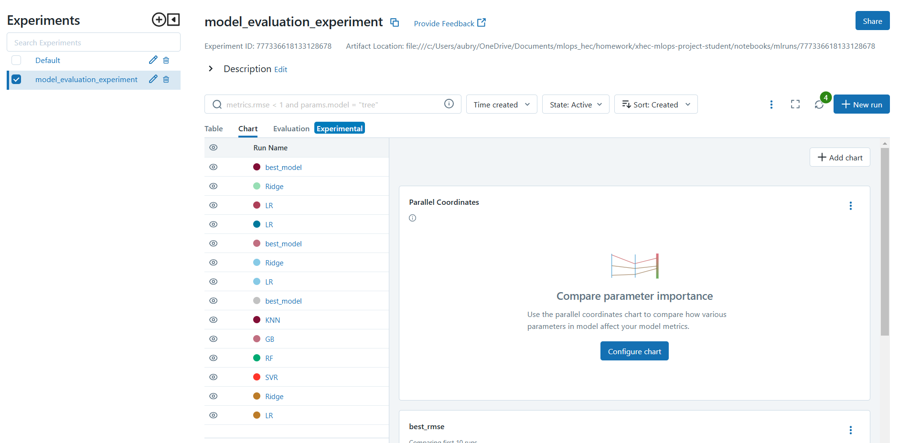
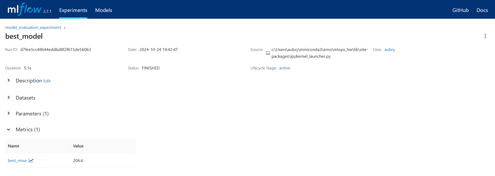
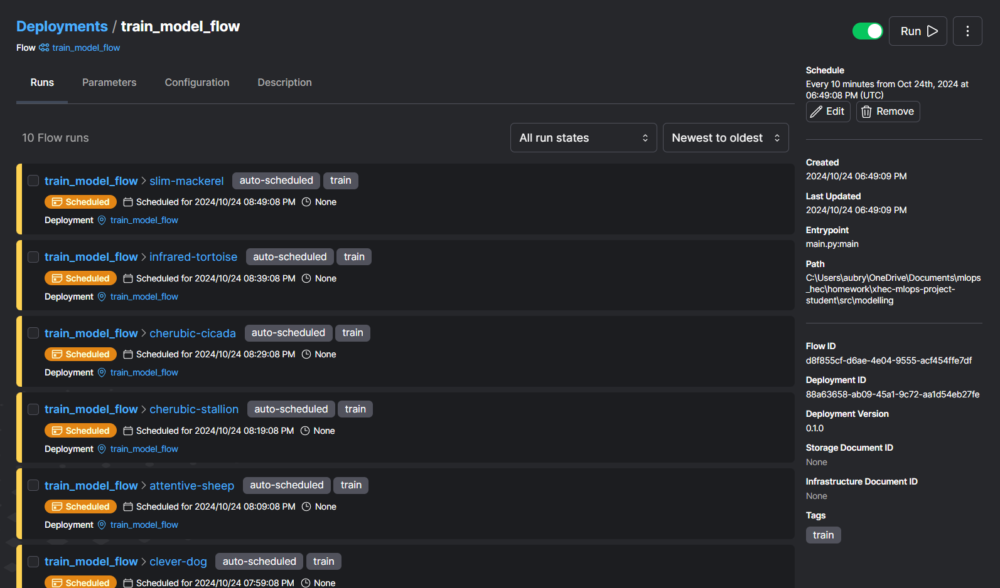
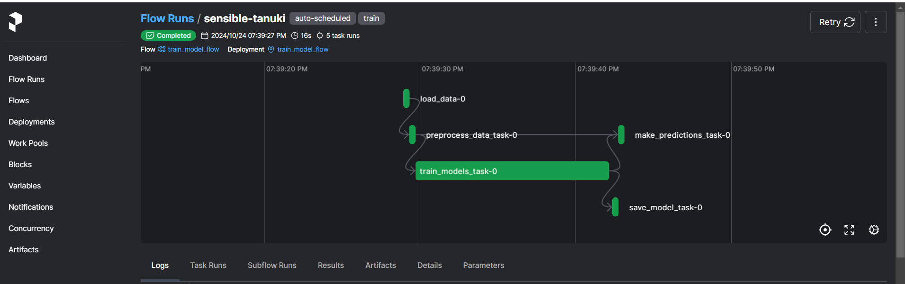

<div align="center">

# xhec-mlops-project-student

[]()
[](https://github.com/psf/black)
[](https://pycqa.github.io/isort/)
[](https://github.com/astral-sh/ruff)
[](https://github.com/artefactory/xhec-mlops-project-student/blob/main/.pre-commit-config.yaml)

</div>

This repository has for purpose to industrialize the [Abalone age prediction](https://www.kaggle.com/datasets/rodolfomendes/abalone-dataset) Kaggle contest.

<details>
<summary>Details on the Abalone Dataset</summary>

The age of abalone is determined by cutting the shell through the cone, staining it, and counting the number of rings through a microscope -- a boring and time-consuming task. Other measurements, which are easier to obtain, are used to predict the age.

**Goal**: predict the age of abalone (column "Rings") from physical measurements ("Shell weight", "Diameter", etc...)

You can download the dataset on the [Kaggle page](https://www.kaggle.com/datasets/rodolfomendes/abalone-dataset)

</details>

## Table of Contents

- [Project Requirements](#project-requirements)
- [Setup Instructions](#setup-instructions)
- [Running the Project](#running-the-project)
- [Development Process](#development-process)
- [Docker Deployment](#docker-deployment)

## Project Requirements

### Deliverables

1. **Model Training Workflow using Prefect**
   - Separate modules for training and inference with Prefect `flow` and `task` objects
   - Reproducible model and encoder training process

2. **Automated Retraining**
   - Prefect deployment for regular model retraining

3. **Prediction API**
   - Dockerized local application
   - Input validation using Pydantic
   - Predictions on new data

### Evaluation Criteria

- Code quality (structure, naming, docstrings, typing)
- Code formatting standards
- Functional implementation
- Documentation and reproducibility
- Pull Request usage

## Setup Instructions

### Using Conda
```bash
conda env create -f environment.yml
conda activate your-env-name
```

### Using Poetry
```bash
poetry install
```

### Pre-commit Setup
```bash
pip install pre-commit
pre-commit install
```

### Dependencies
```bash
pip-compile requirements.in
pipreqs . --savepath requirements.in
```

## Running the Project

### 1. Model Training
Run the modelling.ipynb Notebook.

```bash
mlflow ui
```

### 2. Prefect Configuration

```bash
prefect config set PREFECT_API_URL='http://localhost:4200/api'

# Verify configuration
prefect config view

# Start Prefect server
prefect server start

# Run deployment
python src/modelling/deployment.py
```

Visit http://0.0.0.0:4200/deployments for deployment interface

### 3. Docker Commands

```bash
# Build image
docker build -t api-with-prefect -f Dockerfile.app .

# Run container
docker run -p 8000:8000 -p 4200:4200 api-with-prefect
```

## Development Process

1. Fork repository (keep all branches)
2. Add team members as admins
3. Follow numbered branches
4. Read PR_i.md in each branch
5. Make commits
6. Create single PR per branch
7. Merge to main

### Tips
- Use virtual environment
- Install pre-commit hooks
- Maintain clean requirements
- Remove unused code/TODOs

## MLflow Visualization

You can see model experiments in MLflow:


Best model from last run (LR):


## Prefect Interface

Scheduled retraining view:


Quick run interface:

